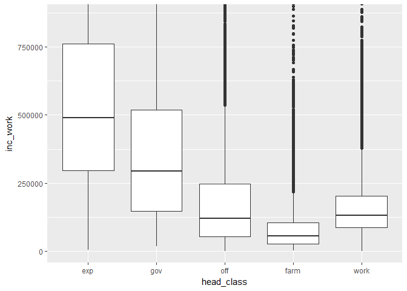

# Typical Filipino

# Introduction
Filipinos are harding working people and yet they tend to be careless with
their money. They would choose to work far from home to provide for their
family. This an admirable trait and yet it seems to be contradicting on the way
they would spend their money. Even if their income would increas, so does their
expenditure. I would hear stories of fellow Filipinos spending a lifetime of
savings over a weekend visiting relatives, whether from abroad or just in the
province.

## Objectives
In this article, I would like to know how Filipinos spend their money in
relation to their income.

## Dataset Source
This dataset is from The Philippine Statistics Authority who conducts the 
Family Income and Expediture Survey (FEIS) every 3 years nationwide. This is 
from the 2015 most recent survey. The raw data was cleaned by Francis Paul 
Flores from his [kaggle.com/grosvenpaul](https://www.kaggle.com/grosvenpaul/family-income-and-expenditure/downloads/Family%20Income%20and%20Expenditure.csv).

# Analysis Section
The Dataset contains 41,544 observations of Filipino Households from every 
Region of the country. It is comprised of 60 variables describing each family 
on their income, family description and expenditure.


```r
library(readr)

fies <- read_csv("fies.csv")

names(fies)
```

```
##  [1] "Total Household Income"                       
##  [2] "Region"                                       
##  [3] "Total Food Expenditure"                       
##  [4] "Main Source of Income"                        
##  [5] "Agricultural Household indicator"             
##  [6] "Bread and Cereals Expenditure"                
##  [7] "Total Rice Expenditure"                       
##  [8] "Meat Expenditure"                             
##  [9] "Total Fish and  marine products Expenditure"  
## [10] "Fruit Expenditure"                            
## [11] "Vegetables Expenditure"                       
## [12] "Restaurant and hotels Expenditure"            
## [13] "Alcoholic Beverages Expenditure"              
## [14] "Tobacco Expenditure"                          
## [15] "Clothing, Footwear and Other Wear Expenditure"
## [16] "Housing and water Expenditure"                
## [17] "Imputed House Rental Value"                   
## [18] "Medical Care Expenditure"                     
## [19] "Transportation Expenditure"                   
## [20] "Communication Expenditure"                    
## [21] "Education Expenditure"                        
## [22] "Miscellaneous Goods and Services Expenditure" 
## [23] "Special Occasions Expenditure"                
## [24] "Crop Farming and Gardening expenses"          
## [25] "Total Income from Entrepreneurial Acitivites" 
## [26] "Household Head Sex"                           
## [27] "Household Head Age"                           
## [28] "Household Head Marital Status"                
## [29] "Household Head Highest Grade Completed"       
## [30] "Household Head Job or Business Indicator"     
## [31] "Household Head Occupation"                    
## [32] "Household Head Class of Worker"               
## [33] "Type of Household"                            
## [34] "Total Number of Family members"               
## [35] "Members with age less than 5 year old"        
## [36] "Members with age 5 - 17 years old"            
## [37] "Total number of family members employed"      
## [38] "Type of Building/House"                       
## [39] "Type of Roof"                                 
## [40] "Type of Walls"                                
## [41] "House Floor Area"                             
## [42] "House Age"                                    
## [43] "Number of bedrooms"                           
## [44] "Tenure Status"                                
## [45] "Toilet Facilities"                            
## [46] "Electricity"                                  
## [47] "Main Source of Water Supply"                  
## [48] "Number of Television"                         
## [49] "Number of CD/VCD/DVD"                         
## [50] "Number of Component/Stereo set"               
## [51] "Number of Refrigerator/Freezer"               
## [52] "Number of Washing Machine"                    
## [53] "Number of Airconditioner"                     
## [54] "Number of Car, Jeep, Van"                     
## [55] "Number of Landline/wireless telephones"       
## [56] "Number of Cellular phone"                     
## [57] "Number of Personal Computer"                  
## [58] "Number of Stove with Oven/Gas Range"          
## [59] "Number of Motorized Banca"                    
## [60] "Number of Motorcycle/Tricycle"
```

Each variable is described accordingly in their labels.


```r
# Rename Lables for easier reference.
names(fies) <- c("income", "region", "expense", "source", 
                 "agri_house", "exp_bread", "exp_rice", "exp_meat", 
                 "exp_seafood", "exp_fruit", "exp_veg", "exp_resto_hotel", 
                 "exp_alcoh", "exp_taba", "exp_clothe", "exp_house_water", 
                 "exp_rent", "exp_med", "exp_trans", "exp_comms", 
                 "exp_edu", "exp_misc", "exp_spec", "exp_farm",
                 "inc_entrep", "head_gender", "head_age", "head_stat", 
                 "head_educ", "head_job_bus", "head_occup", "head_workclass", 
                 "family_t", "family_n", "baby_n", "kid_n", 
                 "employed_n", "house_t", "roof_t", "wall_t", 
                 "house_area", "house_age", "bed_n", "house_tenure",
                 "toilet", "electric", "water_t", "tv_n", 
                 "DVD_n", "sterio_n", "ref_n", "wash_n", 
                 "aircon_n", "car_n", "tel_n", "cell_n",
                 "pc_n", "stove_n", "mboat_n", "mbike_n")

names(fies)
```

```
##  [1] "income"          "region"          "expense"        
##  [4] "source"          "agri_house"      "exp_bread"      
##  [7] "exp_rice"        "exp_meat"        "exp_seafood"    
## [10] "exp_fruit"       "exp_veg"         "exp_resto_hotel"
## [13] "exp_alcoh"       "exp_taba"        "exp_clothe"     
## [16] "exp_house_water" "exp_rent"        "exp_med"        
## [19] "exp_trans"       "exp_comms"       "exp_edu"        
## [22] "exp_misc"        "exp_spec"        "exp_farm"       
## [25] "inc_entrep"      "head_gender"     "head_age"       
## [28] "head_stat"       "head_educ"       "head_job_bus"   
## [31] "head_occup"      "head_workclass"  "family_t"       
## [34] "family_n"        "baby_n"          "kid_n"          
## [37] "employed_n"      "house_t"         "roof_t"         
## [40] "wall_t"          "house_area"      "house_age"      
## [43] "bed_n"           "house_tenure"    "toilet"         
## [46] "electric"        "water_t"         "tv_n"           
## [49] "DVD_n"           "sterio_n"        "ref_n"          
## [52] "wash_n"          "aircon_n"        "car_n"          
## [55] "tel_n"           "cell_n"          "pc_n"           
## [58] "stove_n"         "mboat_n"         "mbike_n"
```

I have modified each one to make it easier for coding.


```r
library(ggplot2)

ggplot(fies, aes(income)) +
  geom_histogram()
```

<!-- -->

There are a lot of low-income and few high-income households that would make
the graph skew to the left and stretch out to the right.


```r
summary(fies$income)
```

```
##     Min.  1st Qu.   Median     Mean  3rd Qu.     Max. 
##    11285   104895   164080   247556   291138 11815988
```

Average income per household would be at 247,556 Php annually.

<!-- -->

I wanted to see where this average is in our distribution. Since the
distribution is skewed by the large disparity of income, I transform the income
into log base 10. Think of it like I am bringing the incomes bins closer
together to get a better view on the distribution.

Marked in red, the average income is slightly on the right from the center.
This tells us that the average does not best describe the whole distribution.
In other words, 247k Php annual income is really high for most Filipinos.


```r
fies$head_occup <- factor(fies$head_occup)
fies$head_workclass <- factor(fies$head_workclass)

ggplot(fies, aes(income)) +
  geom_histogram() +
  scale_x_continuous(
                     trans = log10_trans(), 
                     breaks = c(10000, 25000, 70000,
                                150000, 400000, 
                                1000000, 2000000)) +
  facet_wrap(~ head_workclass)  +
  geom_vline(data = fies, 
             aes(xintercept = mean(fies$income)), 
             color = I("red"))
```

<!-- -->

I divide the distribution according to the working class as defined by the
survey. I do this so that I can see the relationship of the population average
income with the different groups of working classes.

This looks better but the categories are a bit vague and are not familiar of
how I see our working class in society. Therefore, I create our own
classification of the working class based each on the occupation of the head of
the family.


```r
library(stringr)
library(dplyr)

class.expert <- paste(c("managers", "medical", "dentist", "lawyer",
                     "architect", "supervisor", "trade", "education",
                     "chemist", "professionals", "scientist",
                     "justice", "Mechanical engineers", "director",
                     "accountant", "Chemical engineers", 
                     "Electrical Engineers", "Industrial engineers",
                     "designer", "singers", "television", "dancer",
                     "fashion", "marketing", "Civil engineers", "air",
                     "Computer programmers", "nurse", "Librarians",
                     "science", "therapist", "opticians", "Veter",
                     "pilots", "estate agents", "plant operators", 
                     "legislative"),
                   collapse = "|")

class.farmer <- paste(c("farm", "fish", "growers", "gather", "duck",
                      "cultivat", "plant", "hunter", "village",
                      "practitioners", "healers", "diary", "animal"), 
                    collapse = "|")

class.worker <- paste(c("workers", "carpenters", "welder", "helper", "clean",
                      "launder", "labor", "driver", "freight", "mechanics",
                      "mason", "porter", "waiter", "cook", "foremen",
                      "caretaker", "lineman", "varnish", "conductor",
                      "salesperson", "bookkeeper", "inspector", "undertaker", 
                      "loggers", "wood", "roofers", "cutter", "electricians",
                      "assembler", "builder", "metal",  "tanners", "garbage",
                      "repair", "prepare", "rigger", "vendors", "valuers",
                      "setters", "guides", "tasters", "potters", "preservers",
                      "textile", "fitters", "valets", "blasters", 
                      "humanitarian", "staff officers"), 
                    collapse = "|")

class.office <- paste(c("pawn", "buy", "baker", "maker", "tailor", "assistant",
                     "clerk", "engineering technicians", "operators",
                     "artists", "managers/managing proprietors", "insurance",
                     "educ", "principals", "secretaries", "general", 
                     "pharmacists", "commercial", "communications engineers",
                     "draftsmen", "instructors", "travel consultants",
                     "enlisted personnel"), 
                    collapse = "|")

fies$head_class <- with(fies,
                  ifelse(str_detect(head_workclass, "government"), 
                         "gov",
                  ifelse(grepl(class.worker, head_occup, ignore.case = T),
                         "work",
                  ifelse(grepl(class.office, head_occup, ignore.case = T),
                         "off",
                  ifelse(grepl(class.farmer, head_occup, ignore.case = T),
                         "farm",
                  ifelse(grepl(class.expert, head_occup, ignore.case = T),
                         "exp",
                         NA))))))
```


```r
fies.occup <- fies %>%
  filter(is.na(fies$head_class)) %>%
  group_by(head_occup) %>%
  summarise(n= n(),
            income_mean = mean(income),
            income_median = median(income)) %>%
  arrange(desc(n))

fies.occup
```

```
## # A tibble: 1 x 4
##   head_occup     n income_mean income_median
##       <fctr> <int>       <dbl>         <dbl>
## 1       <NA>  7536    285650.6        201883
```

The working classes that I have defined are as follows:

- *Expert.* Jobs that usually requires higher education.
- *Office* Usually found in shops and offices.
- *Government.* Jobs in government.
- *Workers.* Jobs that usually does not require a degree.
- *Farmers.* Jobs that pertain to rural work. Agriculture, Fishing, etc.

These categories are based on my own classifications of how I see the working
class and their overall mean income. I am ignoring the households that did not
specify the occupation of the head of the family.


```r
inc.ave <- fies %>%
  filter(!is.na(head_occup)) %>%
  summarise(mean = mean(income))

inc.ave
```

```
## # A tibble: 1 x 1
##       mean
##      <dbl>
## 1 239113.9
```

Since I am ignoring households that did not specify the occupation of their
head, I get the average income of households that did and store it in inc.ave.


```r
tapply(fies$income, fies$head_class, summary)
```

```
## $exp
##    Min. 1st Qu.  Median    Mean 3rd Qu.    Max. 
##   25133  321260  530172  668838  843932 4208400 
## 
## $farm
##    Min. 1st Qu.  Median    Mean 3rd Qu.    Max. 
##   12911   83998  119494  160549  178824 4810822 
## 
## $gov
##    Min. 1st Qu.  Median    Mean 3rd Qu.    Max. 
##   24886  174310  323632  426544  558545 3805717 
## 
## $off
##     Min.  1st Qu.   Median     Mean  3rd Qu.     Max. 
##    21136   134373   216450   317292   369152 11815988 
## 
## $work
##    Min. 1st Qu.  Median    Mean 3rd Qu.    Max. 
##   11285  104172  151013  193944  232346 7082152
```

I take a quick summary of the different classes and see the different means of
each of the working class.


```r
fies.workers <- fies %>%
  filter(fies$head_class == "work") %>%
  select(head_occup, income, inc_entrep) %>%
  arrange(desc(income), head_occup)

fies.workers
```

```
## # A tibble: 14,459 x 3
##                                                                     head_occup
##                                                                         <fctr>
##  1                                                     Street ambulant vendors
##  2                                           Market and sidewalk stall vendors
##  3                                          Waiters, waitresses and bartenders
##  4 General managers/managing proprietors in personal care, cleaning and relati
##  5                                         Shop salespersons and demonstrators
##  6                                           Market and sidewalk stall vendors
##  7                                           Market and sidewalk stall vendors
##  8                                                         Building caretakers
##  9                                  Production supervisors and general foremen
## 10                                         Shop salespersons and demonstrators
## # ... with 14,449 more rows, and 2 more variables: income <int>,
## #   inc_entrep <int>
```

This is where I group each working class according the occupation of the head
of the family starting with the worker class.


```r
subset(fies.workers, income == "5652261")
```

```
## # A tibble: 1 x 3
##                           head_occup  income inc_entrep
##                               <fctr>   <int>      <int>
## 1 Waiters, waitresses and bartenders 5652261    5107451
```

I noticed one outlier under the worker class that was interesting. One Waiter
was earning Php5,652,261 annually. This does not seem right to me so I took a
deeper look and found out that *income* is actually the sum of salary income
and income from their private business.

The Waiter was just earning Php544,810 from his job and the rest was from his
business, which was Php5,107,451. I reviewed my groupings again and made sure
that I was grouping them according to their income salary from their occupation
and not from their overall income.


```r
fies$inc_work <- with(fies, income - inc_entrep)

# Check if there are no negative income from work.
head(table(sort(fies$inc_work)))
```

```
## 
##   0 137 150 540 550 667 
##  22   1   1   1   1   1
```

I created a new variable that only included their salary income. If income is
the overall income, then deducting income from their business (inc_entrep)
should not give us a negative value.


```r
tapply(fies$inc_work, fies$head_class, summary)
```

```
## $exp
##    Min. 1st Qu.  Median    Mean 3rd Qu.    Max. 
##    4339  295431  490000  602606  761157 3310612 
## 
## $farm
##    Min. 1st Qu.  Median    Mean 3rd Qu.    Max. 
##    1212   26991   54926   89381  103539 3034500 
## 
## $gov
##    Min. 1st Qu.  Median    Mean 3rd Qu.    Max. 
##   18370  147436  294358  387665  518604 3210933 
## 
## $off
##     Min.  1st Qu.   Median     Mean  3rd Qu.     Max. 
##        0    52901   120242   194908   246241 11639365 
## 
## $work
##    Min. 1st Qu.  Median    Mean 3rd Qu.    Max. 
##       0   85926  130510  166069  203123 1796730
```


```r
tapply(fies$income, fies$head_class, summary)
```

```
## $exp
##    Min. 1st Qu.  Median    Mean 3rd Qu.    Max. 
##   25133  321260  530172  668838  843932 4208400 
## 
## $farm
##    Min. 1st Qu.  Median    Mean 3rd Qu.    Max. 
##   12911   83998  119494  160549  178824 4810822 
## 
## $gov
##    Min. 1st Qu.  Median    Mean 3rd Qu.    Max. 
##   24886  174310  323632  426544  558545 3805717 
## 
## $off
##     Min.  1st Qu.   Median     Mean  3rd Qu.     Max. 
##    21136   134373   216450   317292   369152 11815988 
## 
## $work
##    Min. 1st Qu.  Median    Mean 3rd Qu.    Max. 
##   11285  104172  151013  193944  232346 7082152
```

I will still use the mean of their overall income for my basis of the analysis.
However, I will be using their salary income as bases for grouping them
according to their respective working classes.


```r
fies.experts <- fies %>%
  filter(fies$head_class == "exp") %>%
  group_by(head_occup) %>%
  summarise(income_mean = mean(inc_work),
            income_median = median(inc_work),
            n= n()) %>%
  arrange(desc(income_mean))

fies.experts
```

```
## # A tibble: 74 x 4
##                                                                     head_occup
##                                                                         <fctr>
##  1                                          Agronomists and related scientists
##  2                            Aircraft pilots, navigators and flight engineers
##  3                                                                     Lawyers
##  4                              Directors and chief executives of corporations
##  5                                                          Chemical engineers
##  6                                                                    Justices
##  7                                                             Medical doctors
##  8 Production and operations managers in transport, storage and communications
##  9                                      Maritime transport service supervisors
## 10                                                        Mechanical engineers
## # ... with 64 more rows, and 3 more variables: income_mean <dbl>,
## #   income_median <dbl>, n <int>
```


```r
fies.office <- fies %>%
  filter(fies$head_class == "off") %>%
  group_by(head_occup) %>%
  summarise(income_mean = mean(inc_work),
            income_median = median(inc_work),
            n= n()) %>%
  arrange(desc(income_mean))

fies.office
```

```
## # A tibble: 95 x 4
##                                                         head_occup
##                                                             <fctr>
##  1                                Power production plant operators
##  2        Incinerator, water treatment and related plant operators
##  3           Glass and ceramics kiln and related machine operators
##  4                                               School principals
##  5                  Technical and commercial sales representatives
##  6                                       Insurance representatives
##  7 College, university and higher education teaching professionals
##  8                                       Pharmaceutical assistants
##  9                                                          Buyers
## 10                        Electronics and communications engineers
## # ... with 85 more rows, and 3 more variables: income_mean <dbl>,
## #   income_median <dbl>, n <int>
```


```r
fies.farm <- fies %>%
  filter(fies$head_class == "farm") %>%
  group_by(head_occup) %>%
  summarise(income_mean = mean(inc_work),
            income_median = median(inc_work),
            n= n()) %>%
  arrange(desc(income_mean))

fies.farm
```

```
## # A tibble: 35 x 4
##                                                                     head_occup
##                                                                         <fctr>
##  1                                                        Other animal raisers
##  2 Production and operations managers in agriculture, hunting, forestry and fi
##  3                                                            Tree nut farmers
##  4                                                        Hunters and trappers
##  5                                                       Other poultry farmers
##  6                                    Fish-farm cultivators (excluding prawns)
##  7                                                         Hog raising farmers
##  8                                                             Chicken farmers
##  9                                                    Ornamental plant growers
## 10                                                     Other livestock farmers
## # ... with 25 more rows, and 3 more variables: income_mean <dbl>,
## #   income_median <dbl>, n <int>
```


```r
fies$head_class <- factor(fies$head_class, 
                          levels = c("exp", "gov", "off", "farm", "work"),
                          ordered = T)

ggplot(subset(fies, !is.na(head_class)), aes(head_class)) +
  geom_bar()
```

<!-- -->

In our dataset, I generally have more workers than any of the other classes.
Experts are the minority of the group.

### Income Source


```r
ggplot(subset(fies, income != 0 & 
                !is.na(head_class)), 
       aes(income)) +
  geom_histogram(col=I("white")) +
  scale_x_continuous(trans = log10_trans(), 
                     breaks = c(10000, 25000, 70000,
                                239113, 
                                500000, 2000000),
                     limits = c(2000, 2500000)) +
  facet_wrap( ~ head_class, ncol = 2)  +
  geom_vline(data = subset(fies, !is.na(head_class)),
             aes(xintercept = inc.ave),
             color = I("red"))
```

<!-- -->

I go back to the overall income distribution but this time using our custom
work class. I add the average income Php239k and I see that some groups
are below the average line and other groups are above the average line.


```r
# I remove the households that does not specify occupation.
ggplot(subset(fies, inc_work != 0 & 
                !is.na(head_class)), 
       aes(inc_work)) +
  geom_histogram(col=I("white"), fill = I("#00CCFF")) +
  scale_x_continuous(trans = log10_trans(), 
                     breaks = c(10000, 25000, 70000,
                                239113, 
                                500000, 2000000),
                     limits = c(2000, 2500000)) +
  scale_y_continuous(breaks = c(0, 500, 1000, 1500,
                               2000, 2500),
                     limits = c(0, 2500)) +
  facet_wrap( ~ head_class, ncol = 2)  +
  geom_vline(data = subset(fies, !is.na(head_class)),
             aes(xintercept = inc.ave),
             color = I("red"))
```

<!-- -->

If people relied from their salaries, the picture would generally look the same
except for the office and workers, where salaries are more spread out to the
left.


```r
ggplot(subset(fies, inc_entrep != 0 & 
                !is.na(head_class)), 
       aes(inc_entrep)) +
  geom_histogram(col=I("white"), fill = I("#82AF4C")) +
  scale_x_continuous(trans = log10_trans(), 
                     breaks = c(10000, 25000, 70000,
                                239113, 
                                500000, 2000000),
                     limits = c(2000, 2500000)) +
  scale_y_continuous(breaks = c(0, 500, 1000, 1500,
                               2000, 2500),
                     limits = c(0, 2500)) +
  facet_wrap( ~ head_class, ncol = 2)  +
  geom_vline(data = subset(fies, !is.na(head_class)),
             aes(xintercept = inc.ave),
             color = I("red"))
```

<!-- -->

If people relied solely on income from their business, all of them are below
the Average line of the overall income population. 

These grouped histograms shows that Filipinos who works in offices and workers
would commonly rely mostly from their salaries but would still have income from
private business that would support their overall income.


```r
ggplot(subset(fies, !is.na(head_class)), aes(head_class, inc_work)) +
  geom_boxplot() +
  coord_cartesian(ylim = c(0, quantile(fies$inc_work, .98)))
```

<!-- -->


```r
ggplot(subset(fies, !is.na(head_class)), aes(head_class, inc_entrep)) +
  geom_boxplot() +
  coord_cartesian(ylim = c(0, quantile(fies$inc_entrep, .98)))
```

<!-- -->

Both graphs shows that experts are heavily dependent on salaries. While most
groups would treat their business as a secondary source of income, office
employees and farmers would seem to have more profitable business than the rest
of the groups.


```r
library(tidyr)

fies$id <- seq_len(nrow(fies))

fies.n <- fies %>%
  filter(!is.na(fies$head_class)) %>%
  select(id, head_class, inc_entrep, inc_work) %>%
  gather(inc_type, inc, c(inc_work, inc_entrep)) %>%
  arrange(id)

fies.n
```

```
## # A tibble: 68,016 x 4
##       id head_class   inc_type    inc
##    <int>      <ord>      <chr>  <int>
##  1     1        gov   inc_work 435962
##  2     1        gov inc_entrep  44370
##  3     2       work   inc_work 198235
##  4     2       work inc_entrep      0
##  5     3       work   inc_work  82785
##  6     3       work inc_entrep      0
##  7     4       farm   inc_work  92009
##  8     4       farm inc_entrep  15580
##  9     5        off   inc_work 113635
## 10     5        off inc_entrep  75687
## # ... with 68,006 more rows
```

I would like to compare work income from business income to find out the
relationship. I transform the data from wide format to long format so that
I can graph the data in a frequency polygon.


```r
ggplot(fies.n, aes(inc, color = inc_type)) +
  geom_freqpoly(alpha =.5) +
  scale_x_continuous(trans = log10_trans(), 
                     breaks = c(10000, 25000, 70000,
                                239113, 
                                500000, 2000000),
                     limits = c(2000, 2500000)) +
  facet_wrap(~ head_class, ncol = 2)
```

<!-- -->

I see that farmers have both their salaries from business income at almost
similar distribution with their salary income. Office Employees have income
from Salaries higher than their business income. While workers would have a
distribution that have a higher income from Salaries and income from business
more spread out. Government employees and Professionals does not have a clear
relationship between income from salaries business.

But this is not clear because I am mixing households with 2 sources of income
(salary and Business) with the ones with only 1 source of income.


```r
fies.dual <- fies %>%
  filter(!is.na(head_class)) %>%
  filter(inc_work > 0 & inc_entrep > 0) %>%
  select(id, head_class, income, inc_work, inc_entrep) %>%
  mutate(salary = inc_work/income,
         business = inc_entrep/income) %>%
  gather(inc_type, prop, c(salary, business)) %>%
  select(id, head_class, inc_type, prop) %>%
  arrange(id)

fies.dual
```

```
## # A tibble: 47,794 x 4
##       id head_class inc_type       prop
##    <int>      <ord>    <chr>      <dbl>
##  1     1        gov   salary 0.90762639
##  2     1        gov business 0.09237361
##  3     4       farm   salary 0.85518966
##  4     4       farm business 0.14481034
##  5     5        off   salary 0.60022079
##  6     5        off business 0.39977921
##  7     7       farm   salary 0.63604050
##  8     7       farm business 0.36395950
##  9     8       farm   salary 0.61588903
## 10     8       farm business 0.38411097
## # ... with 47,784 more rows
```

```r
length(unique(fies.dual$id))
```

```
## [1] 23897
```

Out of the total 41,544 households, 23,897 have 2 sources of income. I extract
these observations and mold the data to enable us to see where these income are
coming from according to our work class.


```r
ggplot(fies.dual, aes(head_class, prop, fill = inc_type)) +
  geom_boxplot()
```

<!-- -->

Households who have 2 sources income would rely more on their salary than they
would their business. This is more so for Experts, Government and Workers where
they would get 75% of their income from their salary. While Office and Farmers
would have their Business income producing at almost the same level from their
Salary income.

### Spending Habits


```r
fies.w <- fies %>%
  filter(!is.na(head_class)) %>%
  select(id, head_class, income, expense)
```


```r
ggplot(fies.w, aes(income, expense)) +
  geom_point(alpha = .2) +
  scale_x_continuous(limits = c(0, quantile(fies$income, .98))) +
  scale_y_continuous(limits = c(0, quantile(fies$expense, .98)))
```

<!-- -->

I want to relate expense with their income and if I graph the relationship,
I see that as income increase, so does their expenses, which is obvious.


```r
ggplot(fies.w, aes(income, expense, color = head_class)) +
  geom_point(alpha = .2) +
  scale_x_continuous(limits = c(0, quantile(fies$income, .98))) +
  scale_y_continuous(limits = c(0, quantile(fies$expense, .98)))
```

<!-- -->

The same graph but this time with color grouped according to our custom 
I see which work class have higher incomes. But this is not really clear
because of overplotting.


```r
ggplot(fies.w, aes(income, expense, color = head_class)) +
  geom_point(position = "jitter", alpha = .5, shape = 21) +
  scale_x_continuous(trans = log10_trans(), 
                     limits = c(15000, quantile(fies$income, .99)),
                     breaks = c(10000, 25000, 70000,
                                239113, 
                                500000, 2000000)) +
  scale_y_continuous(trans = log10_trans(), 
                     limits = c(15000, quantile(fies$expense, .99)),
                     breaks = c(10000, 25000, 70000,
                                239113, 
                                500000, 2000000))
```

<!-- -->

This graph shows as a more linear relationship between expense and income but
the working class is still unclear.


```r
ggplot(fies.w, aes(income, expense, color = head_class)) +
  geom_point(position = "jitter", alpha = .5, shape = 21) +
  scale_x_continuous(trans = log10_trans(), 
                     limits = c(15000, quantile(fies$income, .98)),
                     breaks = c(10000, 25000, 70000,
                                239113, 
                                500000, 2000000)) +
  scale_y_continuous(trans = log10_trans(), 
                     limits = c(15000, quantile(fies$income, .98)),
                     breaks = c(10000, 25000, 70000,
                                239113, 
                                500000, 2000000)) +
  facet_wrap(~head_class)
```

<!-- -->
 
Splitting the graphs in a facet, it seems that all classes are resembling the
same pattern where the more income they have the higher they would spend. This
does not tell us anything new. And I get to thinking, what are they actually 
spending on?


```r
fies.w.exp <- fies %>%
  filter(!is.na(head_class)) %>%
  mutate(expense_total = exp_bread + exp_rice + exp_meat + exp_seafood + 
           exp_fruit + exp_veg + exp_resto_hotel + exp_spec + exp_clothe +
           exp_alcoh + exp_taba + exp_house_water + exp_rent + exp_med +
           exp_farm + exp_edu + exp_comms + exp_trans + exp_misc) %>%
  mutate(Food = (exp_bread + exp_rice + exp_meat + exp_seafood + 
           exp_fruit + exp_veg) / expense_total,
         Luxury = (exp_resto_hotel + exp_spec + exp_clothe) / expense_total,
         Vice = (exp_alcoh + exp_taba) / expense_total,
         House = (exp_house_water + exp_rent) / expense_total,
         Medical = exp_med / expense_total,
         Farming = exp_farm / expense_total,
         Education = exp_edu / expense_total,
         Living = (exp_comms + exp_trans + exp_misc) / expense_total) %>%
  gather(cashflow, cash, c(Food, Luxury, Vice, House, Medical,
                           Farming, Education, Living)) %>%
  select(id, head_class, cashflow, cash) %>%
  arrange(id)

fies.w.exp$cashflow <- factor(fies.w.exp$cashflow)
fies.w.exp
```

```
## # A tibble: 272,064 x 4
##       id head_class  cashflow        cash
##    <int>      <ord>    <fctr>       <dbl>
##  1     1        gov      Food 0.398710508
##  2     1        gov    Luxury 0.042562427
##  3     1        gov      Vice 0.000000000
##  4     1        gov     House 0.269154817
##  5     1        gov   Medical 0.009937078
##  6     1        gov   Farming 0.055678679
##  7     1        gov Education 0.104056179
##  8     1        gov    Living 0.119900313
##  9     2       work      Food 0.322843155
## 10     2       work    Luxury 0.056804834
## # ... with 272,054 more rows
```

I just realized that the *expense* is the total expense of food and not the
total expense overall. The above graphs in this section are wrong. I correct
this by adding all expenses under *expense_total*.


```r
ggplot(fies.w.exp, aes(head_class, cash, fill = cashflow)) +
  geom_boxplot() 
```

<!-- -->

This boxplots shows the proportion of each group expenses. It enables us to see
what each goup are spending on and are prioritizing. I have grouped the
expenses according to the following categories:

- *Food:* Bread, Cereals, Rice, Meat, Fish, Fruit, Vegetables Expenses.
- *Luxury:* Restaurant, Hotel, Clothing and Special Occasions Expenses.
- *Vices:* Alcoholic and Tabacco Expenses.
- *House:* Housing, Water, Rent Expenses.
- *Living:* Transportation, Communication, Misc and Services Expenses.
- *Medical:* Medical Expenses.
- *Education:* Education Expenses.
- *Farming:* Farming and Gardening Expenses.


```r
fies %>%
  mutate(expense = exp_bread + exp_rice + exp_meat + exp_seafood + 
           exp_fruit + exp_veg + exp_resto_hotel + exp_spec + exp_clothe +
           exp_alcoh + exp_taba + exp_house_water + exp_rent + exp_med +
           exp_farm + exp_edu + exp_comms + exp_trans + exp_misc)
```

```
## # A tibble: 41,544 x 63
##    income region expense                     source agri_house exp_bread
##     <int>  <chr>   <int>                      <chr>      <int>     <int>
##  1 480332    CAR  347889              Wage/Salaries          0     42140
##  2 198235    CAR  212834              Wage/Salaries          0     17329
##  3  82785    CAR  123885              Wage/Salaries          1     34182
##  4 107589    CAR  152082              Wage/Salaries          0     34030
##  5 189322    CAR  204919              Wage/Salaries          0     34820
##  6 152883    CAR  133177              Wage/Salaries          0     29065
##  7 198621    CAR  272643              Wage/Salaries          0     40992
##  8 134961    CAR  242183    Other sources of Income          1     37168
##  9 171152    CAR  113826    Other sources of Income          0     23117
## 10 625753    CAR  329274 Enterpreneurial Activities          0     56003
## # ... with 41,534 more rows, and 57 more variables: exp_rice <int>,
## #   exp_meat <int>, exp_seafood <int>, exp_fruit <int>, exp_veg <int>,
## #   exp_resto_hotel <int>, exp_alcoh <int>, exp_taba <int>,
## #   exp_clothe <int>, exp_house_water <int>, exp_rent <int>,
## #   exp_med <int>, exp_trans <int>, exp_comms <int>, exp_edu <int>,
## #   exp_misc <int>, exp_spec <int>, exp_farm <int>, inc_entrep <int>,
## #   head_gender <chr>, head_age <int>, head_stat <chr>, head_educ <chr>,
## #   head_job_bus <chr>, head_occup <fctr>, head_workclass <fctr>,
## #   family_t <chr>, family_n <int>, baby_n <int>, kid_n <int>,
## #   employed_n <int>, house_t <chr>, roof_t <chr>, wall_t <chr>,
## #   house_area <int>, house_age <int>, bed_n <int>, house_tenure <chr>,
## #   toilet <chr>, electric <int>, water_t <chr>, tv_n <int>, DVD_n <int>,
## #   sterio_n <int>, ref_n <int>, wash_n <int>, aircon_n <int>,
## #   car_n <int>, tel_n <int>, cell_n <int>, pc_n <int>, stove_n <int>,
## #   mboat_n <int>, mbike_n <int>, head_class <ord>, inc_work <int>,
## #   id <int>
```

I add the expenses overall and add it to our main table *fies* as *expense*.


```r
fies.n.exp <- fies %>%
  filter(!is.na(head_class)) %>%
  mutate(Food = exp_bread + exp_rice + exp_meat + exp_seafood + 
           exp_fruit + exp_veg,
         Luxury = exp_resto_hotel + exp_spec + exp_clothe,
         Vice = exp_alcoh + exp_taba,
         House = exp_house_water + exp_rent,
         Medical = exp_med,
         Farming = exp_farm ,
         Education = exp_edu,
         Living = exp_comms + exp_trans + exp_misc) %>%
  gather(cashflow, cash, c(Food, Luxury, Vice, House, Medical,
                           Farming, Education, Living)) %>%
  select(id, head_class, income, cashflow, cash) %>%
  arrange(id)

fies.n.exp
```

```
## # A tibble: 272,064 x 5
##       id head_class income  cashflow   cash
##    <int>      <ord>  <int>     <chr>  <int>
##  1     1        gov 480332      Food 138707
##  2     1        gov 480332    Luxury  14807
##  3     1        gov 480332      Vice      0
##  4     1        gov 480332     House  93636
##  5     1        gov 480332   Medical   3457
##  6     1        gov 480332   Farming  19370
##  7     1        gov 480332 Education  36200
##  8     1        gov 480332    Living  41712
##  9     2       work 198235      Food  68712
## 10     2       work 198235    Luxury  12090
## # ... with 272,054 more rows
```

I transform the data into another long format but this time expenses are split
according to their different types. Income will be used as reference bu when I
do transform the data, it replicates income 8 times. It does this because there
are 8 types of expenses. I tried chaning the income as a factor but it made my
graph into a qualitative graph that made my x-axis lables to detailed. This just makes the points darker but the plot is still more or less the same.


```r
ggplot(fies.n.exp, aes(income, cash, fill = cashflow, color = I("white"))) +
  geom_point(position = "jitter", alpha = .2, shape = 21) +
  scale_x_continuous(trans = log10_trans(), 
                     breaks = c(10000, 25000, 70000,
                                239113, 
                                500000, 2000000)) +
  scale_y_continuous(trans = log10_trans(),
                     breaks = c(1000, 9000, 20000,
                                40000, 100000)) +
  scale_fill_brewer(palette = "Set1") +
  facet_wrap(~head_class)
```

<!-- -->

From the graph, it would seem Filipinos would tend to prioritize food above
else regardless of working class. With the exception of the farmers, who would
have farming as their major expense.


```r
ggplot(fies.n.exp, aes(income, cash, 
                       fill = head_class, color = I("white"))) +
  geom_point(position = "jitter", alpha = .2, shape = 21) +
  scale_x_continuous(trans = log10_trans(),
                     breaks = c(10000, 25000, 70000,
                                239113, 
                                500000, 2000000)) +
  scale_y_continuous(trans = log10_trans(),
                     breaks = c(1000, 9000, 20000,
                                40000, 100000)) +
  scale_fill_brewer(palette = "Set1") +
  facet_wrap(~cashflow)
```

<!-- -->

I look at the inverse of the graph and see the data from the perspective of the
type of expenses. It is still a little bit chaotic but there are certain
aspects I can see. For instance, housing, living and luxury expenses are
linearly correlated. As income increases, these expenses increase as well. Food
is interesting because it also increases but only to a point. I gues no matter
how rich you are, your taste in food does not change.


```r
ggplot(fies.n.exp, aes(income, cash, fill = cashflow, color = I("white"))) +
  geom_point(position = "jitter", alpha = .2, shape = 21) +
  scale_x_continuous(trans = log10_trans(),
                     breaks = c(10000, 25000, 70000,
                                239113, 
                                500000, 2000000)) +
  scale_y_continuous(trans = log10_trans(),
                     breaks = c(1000, 9000, 20000,
                                40000, 100000)) +
  scale_color_brewer(palette = "Set1") +
  facet_grid(head_class~cashflow)
```

<!-- -->

Splitting the data in a grid, I see that housing, living and luxury have a
clear linear relationship with income. It seems that these expenses increases
as income increases ragardless of the working class. Food expense increases
only to a point. It is sad to see that education seems to be as varied as their
expenses for vices.

### Savings

I take a look at the savings of each Filipino households by taking in a new
variable *savings*, which is income minus expense.


```r
fies <- transform(fies, savings = income - expense)

fies <- transform(fies, sav_inc_ratio = savings/income)

head(fies)
```

```
##   income region expense        source agri_house exp_bread exp_rice
## 1 480332    CAR  117848 Wage/Salaries          0     42140    38300
## 2 198235    CAR   67766 Wage/Salaries          0     17329    13008
## 3  82785    CAR   61609 Wage/Salaries          1     34182    32001
## 4 107589    CAR   78189 Wage/Salaries          0     34030    28659
## 5 189322    CAR   94625 Wage/Salaries          0     34820    30167
## 6 152883    CAR   73326 Wage/Salaries          0     29065    25190
##   exp_meat exp_seafood exp_fruit exp_veg exp_resto_hotel exp_alcoh
## 1    24676       16806      3325   13460            3000         0
## 2    17434       11073      2035    7833            2360       960
## 3     7783        2590      1730    3795            4545       270
## 4    10914       10812       690    7887            6280       480
## 5    18391       11309      1395   11260            6400      1040
## 6    15336        8572      2614    9035               0       180
##   exp_taba exp_clothe exp_house_water exp_rent exp_med exp_trans exp_comms
## 1        0       4607           63636    30000    3457      4776      2880
## 2     2132       8230           41370    27000    3520     12900      5700
## 3     4525       2735           14340     7200      70       324       420
## 4        0       1390           16638     6600      60      6840       660
## 5        0       4620           31122    16800     140      6996      2100
## 6      240       1930           22782     6600      95      4044      1500
##   exp_edu exp_misc exp_spec exp_farm inc_entrep head_gender head_age
## 1   36200    34056     7200    19370      44370      Female       49
## 2   29300     9150     1500        0          0        Male       40
## 3     425     6450      500        0          0        Male       39
## 4     300     3762      500    15580      15580        Male       52
## 5       0     8472     1000    18887      75687        Male       65
## 6       0     5394      600        0          0        Male       46
##   head_stat                                        head_educ
## 1    Single Teacher Training and Education Sciences Programs
## 2   Married                      Transport Services Programs
## 3   Married                                          Grade 3
## 4   Married                              Elementary Graduate
## 5   Married                              Elementary Graduate
## 6   Married                          Second Year High School
##        head_job_bus
## 1 With Job/Business
## 2 With Job/Business
## 3 With Job/Business
## 4 With Job/Business
## 5 With Job/Business
## 6 With Job/Business
##                                                                            head_occup
## 1                                 General elementary education teaching professionals
## 2                                                                Transport conductors
## 3                                                              Farmhands and laborers
## 4                                                                        Rice farmers
## 5 General managers/managing proprietors in transportation, storage and communications
## 6                                                       Heavy truck and lorry drivers
##                                     head_workclass        family_t
## 1     Worked for government/government corporation Extended Family
## 2                 Worked for private establishment   Single Family
## 3                 Worked for private establishment   Single Family
## 4 Employer in own family-operated farm or business   Single Family
## 5                Self-employed wihout any employee   Single Family
## 6                 Worked for private establishment   Single Family
##   family_n baby_n kid_n employed_n      house_t
## 1        4      0     1          1 Single house
## 2        3      0     1          2 Single house
## 3        6      0     4          3 Single house
## 4        3      0     3          2 Single house
## 5        4      0     0          2 Single house
## 6        4      0     0          3 Single house
##                                                                   roof_t
## 1 Strong material(galvanized,iron,al,tile,concrete,brick,stone,asbestos)
## 2 Strong material(galvanized,iron,al,tile,concrete,brick,stone,asbestos)
## 3                                     Light material (cogon,nipa,anahaw)
## 4                                     Light material (cogon,nipa,anahaw)
## 5                                     Light material (cogon,nipa,anahaw)
## 6                               Mixed but predominantly strong materials
##         wall_t house_area house_age bed_n
## 1       Strong         80        75     3
## 2       Strong         42        15     2
## 3        Light         35        12     1
## 4        Light         30        15     1
## 5 Quite Strong         54        16     3
## 6       Strong         40         7     2
##                                    house_tenure
## 1 Own or owner-like possession of house and lot
## 2 Own or owner-like possession of house and lot
## 3 Own or owner-like possession of house and lot
## 4 Own or owner-like possession of house and lot
## 5 Own or owner-like possession of house and lot
## 6 Own or owner-like possession of house and lot
##                                                           toilet electric
## 1 Water-sealed, sewer septic tank, used exclusively by household        1
## 2 Water-sealed, sewer septic tank, used exclusively by household        1
## 3   Water-sealed, sewer septic tank, shared with other household        0
## 4                                                     Closed pit        1
## 5 Water-sealed, sewer septic tank, used exclusively by household        1
## 6 Water-sealed, sewer septic tank, used exclusively by household        1
##                                   water_t tv_n DVD_n sterio_n ref_n wash_n
## 1 Own use, faucet, community water system    1     1        0     1      1
## 2 Own use, faucet, community water system    1     1        1     0      1
## 3  Shared, faucet, community water system    0     0        0     0      0
## 4 Own use, faucet, community water system    1     0        0     0      0
## 5 Own use, faucet, community water system    1     0        0     1      0
## 6 Own use, faucet, community water system    1     0        0     0      1
##   aircon_n car_n tel_n cell_n pc_n stove_n mboat_n mbike_n head_class
## 1        0     0     0      2    1       0       0       1        gov
## 2        0     0     0      3    1       0       0       2       work
## 3        0     0     0      0    0       0       0       0       work
## 4        0     0     0      1    0       0       0       0       farm
## 5        0     0     0      3    0       0       0       1        off
## 6        0     0     0      4    0       0       0       1       work
##   inc_work id savings sav_inc_ratio
## 1   435962  1  362484     0.7546530
## 2   198235  2  130469     0.6581532
## 3    82785  3   21176     0.2557951
## 4    92009  4   29400     0.2732621
## 5   113635  5   94697     0.5001902
## 6   152883  6   79557     0.5203783
```

Once I have the Savings of each household, I divide savings over income to get the ratio. I was surprised to see many households in debt.


```r
fies$finance <- with(fies,
                ifelse(sav_inc_ratio < 0, "deficit",
                ifelse(sav_inc_ratio > 0, "surplus", "deficit")))

fies$finance <- factor(fies$finance)

table(fies$finance)
```

```
## 
## deficit surplus 
##     313   41231
```

I counted how many were in debt and those who had a surplus and found that it
was not that many. Only 313 out ouf 41,544 households were in debt and who were
living beyond their means. It is only 0.75 % of the population.


```r
summary(fies$sav_inc_ratio)
```

```
##    Min. 1st Qu.  Median    Mean 3rd Qu.    Max. 
## -8.5995  0.4396  0.5624  0.5510  0.6824  0.9843
```

With the summary of savings to income ration, I see that most Filipinos would
save half of their income.


```r
ggplot(subset(fies, !is.na(head_class)),
       aes(sav_inc_ratio)) +
  geom_histogram(binwidth = .02) +
  coord_cartesian(xlim = c(0, 1)) +
  geom_vline(xintercept = median(fies$sav_inc_ratio),
             color = I("red"))
```

<!-- -->

It is good to know that most Filipinos would save their money rather than
spending it.


```r
ggplot(subset(fies, !is.na(head_class)), 
       aes(sav_inc_ratio)) +
  geom_histogram(binwidth = .02) +
  coord_cartesian(xlim = c(0, 1)) +
  geom_vline(xintercept = median(fies$sav_inc_ratio),
             color = I("red")) +
  facet_wrap(~head_class)
```

<!-- -->

I facet the same graph according to the working class and see a similar trend
when graphing income.


```r
ggplot(subset(fies, !is.na(head_class)),
       aes(income, savings, color = head_class)) +
  geom_point(alpha = .1) +
  scale_x_continuous(limits = c(0, quantile(fies$income, .98))) +
  scale_y_continuous(limits = c(0, quantile(fies$savings, .98)),
                     breaks = c(200000, 400000, 600000, 800000)) +
  facet_wrap(~head_class)
```

<!-- -->

Savings and income in a scatterpolt allows me to see a linear trend for all
working classes.


```r
ggplot(subset(fies, !is.na(head_class)),
       aes(income, savings, color = head_class)) +
  geom_point(alpha = .1) +
  scale_x_continuous(limits = c(0, quantile(fies$income, .98))) +
  scale_y_continuous(limits = c(0, quantile(fies$savings, .98)))
```

<!-- -->

It seems that savings proportion is consistent in that as income increases, so does their proportion of savings.


## Final Plots

### Side Business


```r
library("ggthemes")

ggplot(fies.dual, aes(head_class, prop, fill = inc_type)) +
  geom_boxplot() +
  ggtitle("Side Business") +
  xlab("Working Class") +
  ylab("Income Source Proportion") +
  labs(fill = "Income Source")
```

<!-- -->

Filipino households would tend to have 2 sources of income, either from their salaries or from their side businesses. Experts, workers and government would rely mostly on their salaries. While 55% of the income of office employees and farmers would be from their salaries, 45% would be from their side business. This is interesting because it shows that office workers and farmers are more motivated to have a second source of income than the rest of the working class. Or maybe they have more extra time in their hands and that their job is not time-consuming than the other working class that they would invest it in earning more.

### Financial Priorities

<!-- -->

Filipinos would generally prioritize Food, Housing, Living and Luxry items over everything else. Lower income households would have Food (Green) as their top priority but as income grows, it levels off and housing income slowly takes over as their main income. I guess their food preferences and cost does not change as income increases.

### Filipino Savings


```r
ggplot(subset(fies, !is.na(head_class)), 
       aes(sav_inc_ratio)) +
  geom_histogram(binwidth = .05, col=I("white"), fill = I("#0089F2")) +
  coord_cartesian(xlim = c(0, 1)) +
  geom_vline(xintercept = median(fies$sav_inc_ratio),
             color = I("red")) +
  facet_wrap(~head_class) +
  ggtitle("Filipino Savings") +
  xlab("Savings to Income Ratio") +
  ylab("Count") +
  guides(color = guide_legend(override.aes = list(alpha = 1)))
```

<!-- -->

Filipinos would tend to keep 56% or almost half of their income to savings. But
savings proportions varies according to different groups of working class.
Higher income jobs would generally save more proportion of their income than
lower income jobs.

## Reflections

I find it hard to go back and forth through the exploratory process. When I go
through the analysis, I find certain details that I have overlooked. At this
stage, I have to decide if I should go back to the beginning and change that
detail or should I change it at the point where I found the problem. Take for
example, I thought I was using the total expense in my analysis. It turns out
that I was using the total Food expense. I realized that I was using the wrong
expense after several graphs. I had to choices: to go back and change recompute
the total expense or change it at the stage of my analysis and move on. I ended
up doing the latter.

I guess the hardest part of doing exploratory data analysis (EDA) is
encountering doubt along the process. At some point, I start to question my own
way of thinking and I was afraid that I made too many assumptions, which makes
the whole process questionable. On the other hand, I had to be decisive and
trust my gut feeling so that I can move on. I think the best way to get through
it all is to have 3 principles in mind. 

First, **to see things for what they are**. I try to see thinks as objectively
as I can. i try not to overthink a certain variable or what it means. Most of
all, I try to explain things as plainly as I can even to myself so that people,
including me, can understand the process. 

Second, **I act on the things that I can control**. There are a ton of
variables that I can use and many variations on how to use them. Focusing on
the things that I can control can make things more easier. 

Lastly, **to let go of things that I cannot control**. I cannot know or analyze
everything. I have to let of of things that I have no control over and trust
that everything will make sense in the end.

For future work and anyone who encounters this analysis, try not to rely on
averages and try to think plainly. The terms used in the survey, when I first
found it, was a bit vague and alien. For example, Working Class as defined by
the survey was too technical and did not really relate to a common sociatal
structure that we commonly see. It would be a lot useful if the data indicates
if the occupation is an overseas worker or is working within the country.
Because I know that a lot of Filipinos are working abroad. In addition, a
construction worker working in the Philippines has a much lower salary than the
a construction working working abroad.
