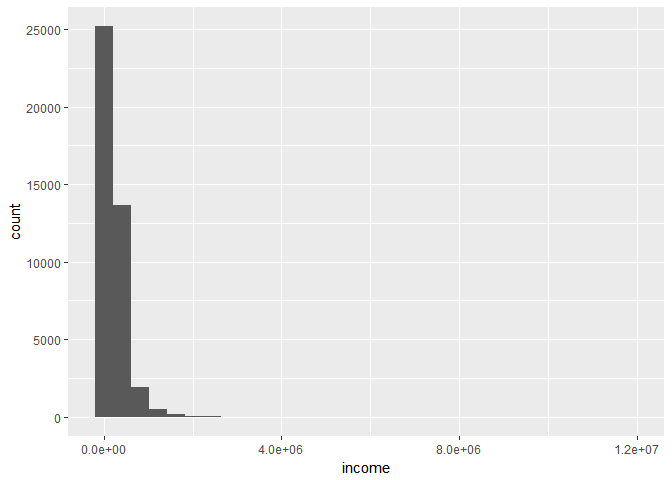

# Typical Filipino

# Introduction
Filipinos are cheerful, resourceful and practical people. It is in our nature to make
the best out a of a situation, no matter how hard it is, and still manage to smile
while talking about it. We get this from our strong family values and religious beliefs.
However, our ideals are not always represented in our actions specially when it comes
to our financial priorities. I would always hear stories of parents working abroad for
10 to 20 years and coming back to their families poorer than they were before they left.

## Objectives
In this article, I would like to uncover the spending habits and financial priorities of
a typical Filipino family and try to understand why Filipinos with good paying jobs 
are still poor. 

## Dataset Source
This dataset is from The Philippine Statistics Authority who conducts the Family Income
and Expediture Survey (FEIS) every 3 years nationwide. This is from the most recent 
survey 2015. The raw data was cleaned by Francis Paul Flores from his
[kaggle.com/grosvenpaul](https://www.kaggle.com/grosvenpaul/datasets).

# Getting a Feel of the Data
The Dataset contains 41,544 observations of Filipino Households from every Region of
the country. It is comprised of 60 variables describing each family on their income,
family description and expenditure.


There are 60 variables in this dataset and are not code friendly. First thing to do is
rename each column key. In the interest of exploration, I will keep each column and 
describe them as I go through this analysis. A detailed desciption of each column is 
documented on a separate txt file for your reference.


```r
names(fies)
```

```
##  [1] "income"          "region"          "expense"        
##  [4] "source"          "agri_house"      "exp_bread"      
##  [7] "exp_rice"        "exp_meat"        "exp_seafood"    
## [10] "exp_fruit"       "exp_veg"         "exp_resto_hotel"
## [13] "exp_alcoh"       "exp_taba"        "exp_clothe"     
## [16] "exp_house_water" "exp_rent"        "exp_med"        
## [19] "exp_trans"       "exp_comms"       "exp_edu"        
## [22] "exp_misc"        "exp_spec"        "exp_farm"       
## [25] "inc_entrep"      "head_gender"     "head_age"       
## [28] "head_stat"       "head_educ"       "head_job_bus"   
## [31] "head_occup"      "head_workclass"  "family_t"       
## [34] "family_n"        "kids_n"          "young_n"        
## [37] "employed_n"      "house_t"         "roof_t"         
## [40] "wall_t"          "house_area"      "house_age"      
## [43] "bed_n"           "house_tenure"    "toilet"         
## [46] "electric"        "water_t"         "tv_n"           
## [49] "DVD_n"           "sterio_n"        "ref_n"          
## [52] "wash_n"          "aircon_n"        "car_n"          
## [55] "tel_n"           "cell_n"          "pc_n"           
## [58] "stove_n"         "mboat_n"         "mbike_n"
```


```
## Classes 'tbl_df', 'tbl' and 'data.frame':	41544 obs. of  60 variables:
##  $ income         : int  480332 198235 82785 107589 189322 152883 198621 134961 171152 625753 ...
##  $ region         : chr  "CAR" "CAR" "CAR" "CAR" ...
##  $ expense        : int  117848 67766 61609 78189 94625 73326 104644 95644 67348 158721 ...
##  $ source         : chr  "Wage/Salaries" "Wage/Salaries" "Wage/Salaries" "Wage/Salaries" ...
##  $ agri_house     : int  0 0 1 0 0 0 0 1 0 0 ...
##  $ exp_bread      : int  42140 17329 34182 34030 34820 29065 40992 37168 23117 56003 ...
##  $ exp_rice       : int  38300 13008 32001 28659 30167 25190 36312 28156 15845 43239 ...
##  $ exp_meat       : int  24676 17434 7783 10914 18391 15336 12968 14640 11464 26488 ...
##  $ exp_seafood    : int  16806 11073 2590 10812 11309 8572 12310 15896 6685 25678 ...
##  $ exp_fruit      : int  3325 2035 1730 690 1395 2614 2565 3365 1370 3880 ...
##  $ exp_veg        : int  13460 7833 3795 7887 11260 9035 15620 10520 5235 11360 ...
##  $ exp_resto_hotel: int  3000 2360 4545 6280 6400 0 6200 1130 10550 15620 ...
##  $ exp_alcoh      : int  0 960 270 480 1040 180 1920 480 0 0 ...
##  $ exp_taba       : int  0 2132 4525 0 0 240 0 0 0 0 ...
##  $ exp_clothe     : int  4607 8230 2735 1390 4620 1930 7930 4085 2780 7740 ...
##  $ exp_house_water: int  63636 41370 14340 16638 31122 22782 24126 40776 8370 65730 ...
##  $ exp_rent       : int  30000 27000 7200 6600 16800 6600 12000 19800 4200 27000 ...
##  $ exp_med        : int  3457 3520 70 60 140 95 340 75 200 1786 ...
##  $ exp_trans      : int  4776 12900 324 6840 6996 4044 12696 4140 7200 5160 ...
##  $ exp_comms      : int  2880 5700 420 660 2100 1500 1848 3000 1800 7200 ...
##  $ exp_edu        : int  36200 29300 425 300 0 0 0 50 8000 13180 ...
##  $ exp_misc       : int  34056 9150 6450 3762 8472 5394 6126 5562 6510 15210 ...
##  $ exp_spec       : int  7200 1500 500 500 1000 600 6400 1500 500 4000 ...
##  $ exp_farm       : int  19370 0 0 15580 18887 0 72290 51840 0 0 ...
##  $ inc_entrep     : int  44370 0 0 15580 75687 0 72290 51840 0 312974 ...
##  $ head_gender    : chr  "Female" "Male" "Male" "Male" ...
##  $ head_age       : int  49 40 39 52 65 46 45 33 17 53 ...
##  $ head_stat      : chr  "Single" "Married" "Married" "Married" ...
##  $ head_educ      : chr  "Teacher Training and Education Sciences Programs" "Transport Services Programs" "Grade 3" "Elementary Graduate" ...
##  $ head_job_bus   : chr  "With Job/Business" "With Job/Business" "With Job/Business" "With Job/Business" ...
##  $ head_occup     : chr  "General elementary education teaching professionals" "Transport conductors" "Farmhands and laborers" "Rice farmers" ...
##  $ head_workclass : chr  "Worked for government/government corporation" "Worked for private establishment" "Worked for private establishment" "Employer in own family-operated farm or business" ...
##  $ family_t       : chr  "Extended Family" "Single Family" "Single Family" "Single Family" ...
##  $ family_n       : int  4 3 6 3 4 4 5 5 2 6 ...
##  $ kids_n         : int  0 0 0 0 0 0 1 1 0 0 ...
##  $ young_n        : int  1 1 4 3 0 0 0 1 2 0 ...
##  $ employed_n     : int  1 2 3 2 2 3 1 0 0 1 ...
##  $ house_t        : chr  "Single house" "Single house" "Single house" "Single house" ...
##  $ roof_t         : chr  "Strong material(galvanized,iron,al,tile,concrete,brick,stone,asbestos)" "Strong material(galvanized,iron,al,tile,concrete,brick,stone,asbestos)" "Light material (cogon,nipa,anahaw)" "Light material (cogon,nipa,anahaw)" ...
##  $ wall_t         : chr  "Strong" "Strong" "Light" "Light" ...
##  $ house_area     : int  80 42 35 30 54 40 35 35 35 70 ...
##  $ house_age      : int  75 15 12 15 16 7 18 48 8 12 ...
##  $ bed_n          : int  3 2 1 1 3 2 1 2 1 3 ...
##  $ house_tenure   : chr  "Own or owner-like possession of house and lot" "Own or owner-like possession of house and lot" "Own or owner-like possession of house and lot" "Own or owner-like possession of house and lot" ...
##  $ toilet         : chr  "Water-sealed, sewer septic tank, used exclusively by household" "Water-sealed, sewer septic tank, used exclusively by household" "Water-sealed, sewer septic tank, shared with other household" "Closed pit" ...
##  $ electric       : int  1 1 0 1 1 1 1 1 1 1 ...
##  $ water_t        : chr  "Own use, faucet, community water system" "Own use, faucet, community water system" "Shared, faucet, community water system" "Own use, faucet, community water system" ...
##  $ tv_n           : int  1 1 0 1 1 1 1 1 1 1 ...
##  $ DVD_n          : int  1 1 0 0 0 0 0 1 0 0 ...
##  $ sterio_n       : int  0 1 0 0 0 0 1 0 0 1 ...
##  $ ref_n          : int  1 0 0 0 1 0 0 0 0 1 ...
##  $ wash_n         : int  1 1 0 0 0 1 0 1 0 0 ...
##  $ aircon_n       : int  0 0 0 0 0 0 0 0 0 0 ...
##  $ car_n          : int  0 0 0 0 0 0 0 0 0 1 ...
##  $ tel_n          : int  0 0 0 0 0 0 0 0 0 0 ...
##  $ cell_n         : int  2 3 0 1 3 4 2 2 2 4 ...
##  $ pc_n           : int  1 1 0 0 0 0 0 0 0 1 ...
##  $ stove_n        : int  0 0 0 0 0 0 0 0 0 0 ...
##  $ mboat_n        : int  0 0 0 0 0 0 0 0 0 0 ...
##  $ mbike_n        : int  1 2 0 0 1 1 1 1 0 0 ...
##  - attr(*, "spec")=List of 2
##   ..$ cols   :List of 60
##   .. ..$ Total Household Income                       : list()
##   .. .. ..- attr(*, "class")= chr  "collector_integer" "collector"
##   .. ..$ Region                                       : list()
##   .. .. ..- attr(*, "class")= chr  "collector_character" "collector"
##   .. ..$ Total Food Expenditure                       : list()
##   .. .. ..- attr(*, "class")= chr  "collector_integer" "collector"
##   .. ..$ Main Source of Income                        : list()
##   .. .. ..- attr(*, "class")= chr  "collector_character" "collector"
##   .. ..$ Agricultural Household indicator             : list()
##   .. .. ..- attr(*, "class")= chr  "collector_integer" "collector"
##   .. ..$ Bread and Cereals Expenditure                : list()
##   .. .. ..- attr(*, "class")= chr  "collector_integer" "collector"
##   .. ..$ Total Rice Expenditure                       : list()
##   .. .. ..- attr(*, "class")= chr  "collector_integer" "collector"
##   .. ..$ Meat Expenditure                             : list()
##   .. .. ..- attr(*, "class")= chr  "collector_integer" "collector"
##   .. ..$ Total Fish and  marine products Expenditure  : list()
##   .. .. ..- attr(*, "class")= chr  "collector_integer" "collector"
##   .. ..$ Fruit Expenditure                            : list()
##   .. .. ..- attr(*, "class")= chr  "collector_integer" "collector"
##   .. ..$ Vegetables Expenditure                       : list()
##   .. .. ..- attr(*, "class")= chr  "collector_integer" "collector"
##   .. ..$ Restaurant and hotels Expenditure            : list()
##   .. .. ..- attr(*, "class")= chr  "collector_integer" "collector"
##   .. ..$ Alcoholic Beverages Expenditure              : list()
##   .. .. ..- attr(*, "class")= chr  "collector_integer" "collector"
##   .. ..$ Tobacco Expenditure                          : list()
##   .. .. ..- attr(*, "class")= chr  "collector_integer" "collector"
##   .. ..$ Clothing, Footwear and Other Wear Expenditure: list()
##   .. .. ..- attr(*, "class")= chr  "collector_integer" "collector"
##   .. ..$ Housing and water Expenditure                : list()
##   .. .. ..- attr(*, "class")= chr  "collector_integer" "collector"
##   .. ..$ Imputed House Rental Value                   : list()
##   .. .. ..- attr(*, "class")= chr  "collector_integer" "collector"
##   .. ..$ Medical Care Expenditure                     : list()
##   .. .. ..- attr(*, "class")= chr  "collector_integer" "collector"
##   .. ..$ Transportation Expenditure                   : list()
##   .. .. ..- attr(*, "class")= chr  "collector_integer" "collector"
##   .. ..$ Communication Expenditure                    : list()
##   .. .. ..- attr(*, "class")= chr  "collector_integer" "collector"
##   .. ..$ Education Expenditure                        : list()
##   .. .. ..- attr(*, "class")= chr  "collector_integer" "collector"
##   .. ..$ Miscellaneous Goods and Services Expenditure : list()
##   .. .. ..- attr(*, "class")= chr  "collector_integer" "collector"
##   .. ..$ Special Occasions Expenditure                : list()
##   .. .. ..- attr(*, "class")= chr  "collector_integer" "collector"
##   .. ..$ Crop Farming and Gardening expenses          : list()
##   .. .. ..- attr(*, "class")= chr  "collector_integer" "collector"
##   .. ..$ Total Income from Entrepreneurial Acitivites : list()
##   .. .. ..- attr(*, "class")= chr  "collector_integer" "collector"
##   .. ..$ Household Head Sex                           : list()
##   .. .. ..- attr(*, "class")= chr  "collector_character" "collector"
##   .. ..$ Household Head Age                           : list()
##   .. .. ..- attr(*, "class")= chr  "collector_integer" "collector"
##   .. ..$ Household Head Marital Status                : list()
##   .. .. ..- attr(*, "class")= chr  "collector_character" "collector"
##   .. ..$ Household Head Highest Grade Completed       : list()
##   .. .. ..- attr(*, "class")= chr  "collector_character" "collector"
##   .. ..$ Household Head Job or Business Indicator     : list()
##   .. .. ..- attr(*, "class")= chr  "collector_character" "collector"
##   .. ..$ Household Head Occupation                    : list()
##   .. .. ..- attr(*, "class")= chr  "collector_character" "collector"
##   .. ..$ Household Head Class of Worker               : list()
##   .. .. ..- attr(*, "class")= chr  "collector_character" "collector"
##   .. ..$ Type of Household                            : list()
##   .. .. ..- attr(*, "class")= chr  "collector_character" "collector"
##   .. ..$ Total Number of Family members               : list()
##   .. .. ..- attr(*, "class")= chr  "collector_integer" "collector"
##   .. ..$ Members with age less than 5 year old        : list()
##   .. .. ..- attr(*, "class")= chr  "collector_integer" "collector"
##   .. ..$ Members with age 5 - 17 years old            : list()
##   .. .. ..- attr(*, "class")= chr  "collector_integer" "collector"
##   .. ..$ Total number of family members employed      : list()
##   .. .. ..- attr(*, "class")= chr  "collector_integer" "collector"
##   .. ..$ Type of Building/House                       : list()
##   .. .. ..- attr(*, "class")= chr  "collector_character" "collector"
##   .. ..$ Type of Roof                                 : list()
##   .. .. ..- attr(*, "class")= chr  "collector_character" "collector"
##   .. ..$ Type of Walls                                : list()
##   .. .. ..- attr(*, "class")= chr  "collector_character" "collector"
##   .. ..$ House Floor Area                             : list()
##   .. .. ..- attr(*, "class")= chr  "collector_integer" "collector"
##   .. ..$ House Age                                    : list()
##   .. .. ..- attr(*, "class")= chr  "collector_integer" "collector"
##   .. ..$ Number of bedrooms                           : list()
##   .. .. ..- attr(*, "class")= chr  "collector_integer" "collector"
##   .. ..$ Tenure Status                                : list()
##   .. .. ..- attr(*, "class")= chr  "collector_character" "collector"
##   .. ..$ Toilet Facilities                            : list()
##   .. .. ..- attr(*, "class")= chr  "collector_character" "collector"
##   .. ..$ Electricity                                  : list()
##   .. .. ..- attr(*, "class")= chr  "collector_integer" "collector"
##   .. ..$ Main Source of Water Supply                  : list()
##   .. .. ..- attr(*, "class")= chr  "collector_character" "collector"
##   .. ..$ Number of Television                         : list()
##   .. .. ..- attr(*, "class")= chr  "collector_integer" "collector"
##   .. ..$ Number of CD/VCD/DVD                         : list()
##   .. .. ..- attr(*, "class")= chr  "collector_integer" "collector"
##   .. ..$ Number of Component/Stereo set               : list()
##   .. .. ..- attr(*, "class")= chr  "collector_integer" "collector"
##   .. ..$ Number of Refrigerator/Freezer               : list()
##   .. .. ..- attr(*, "class")= chr  "collector_integer" "collector"
##   .. ..$ Number of Washing Machine                    : list()
##   .. .. ..- attr(*, "class")= chr  "collector_integer" "collector"
##   .. ..$ Number of Airconditioner                     : list()
##   .. .. ..- attr(*, "class")= chr  "collector_integer" "collector"
##   .. ..$ Number of Car, Jeep, Van                     : list()
##   .. .. ..- attr(*, "class")= chr  "collector_integer" "collector"
##   .. ..$ Number of Landline/wireless telephones       : list()
##   .. .. ..- attr(*, "class")= chr  "collector_integer" "collector"
##   .. ..$ Number of Cellular phone                     : list()
##   .. .. ..- attr(*, "class")= chr  "collector_integer" "collector"
##   .. ..$ Number of Personal Computer                  : list()
##   .. .. ..- attr(*, "class")= chr  "collector_integer" "collector"
##   .. ..$ Number of Stove with Oven/Gas Range          : list()
##   .. .. ..- attr(*, "class")= chr  "collector_integer" "collector"
##   .. ..$ Number of Motorized Banca                    : list()
##   .. .. ..- attr(*, "class")= chr  "collector_integer" "collector"
##   .. ..$ Number of Motorcycle/Tricycle                : list()
##   .. .. ..- attr(*, "class")= chr  "collector_integer" "collector"
##   ..$ default: list()
##   .. ..- attr(*, "class")= chr  "collector_guess" "collector"
##   ..- attr(*, "class")= chr "col_spec"
```


## Income Distribution


```r
library(ggplot2)

ggplot(fies, aes(income)) +
  geom_histogram()
```

<!-- -->
It comes to no surprise that income per household is skewed to the left, where there is more
poor families and few rich people with dramatic outlying incomes.


```r
summary(fies$income)
```

```
##     Min.  1st Qu.   Median     Mean  3rd Qu.     Max. 
##    11285   104895   164080   247556   291138 11815988
```
Doing a quick summary of the income, we see that the average income of each household is
247,556 Php annually. But this is skewed because of the maximum income of 11 mill Php of
the super rich.


```r
ggplot(fies, aes(income)) +
  geom_histogram() +
  scale_x_log10()
```

```
## `stat_bin()` using `bins = 30`. Pick better value with `binwidth`.
```

<!-- -->


