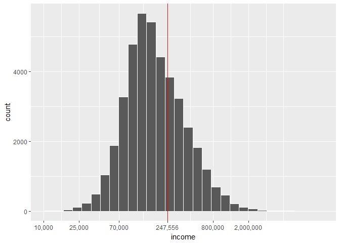

# Typical Filipino

# Introduction
Filipinos are cheerful, resourceful and practical people. It is in our nature to make
the best out a of a situation, no matter how hard it is, and still manage to smile
while talking about it. We get this from our strong family values and religious beliefs.
However, our ideals are not always represented in our actions specially when it comes
to our financial priorities. I would always hear stories of parents working abroad for
10 to 20 years and coming back to their families poorer than they were before they left.

## Objectives
In this article, I would like to uncover the spending habits and financial priorities of
a typical Filipino family and try to understand why Filipinos with good paying jobs 
are still poor. 

## Dataset Source
This dataset is from The Philippine Statistics Authority who conducts the Family Income
and Expediture Survey (FEIS) every 3 years nationwide. This is from the most recent 
survey 2015. The raw data was cleaned by Francis Paul Flores from his
[kaggle.com/grosvenpaul](https://www.kaggle.com/grosvenpaul/datasets).

# Getting a Feel of the Data
The Dataset contains 41,544 observations of Filipino Households from every Region of
the country. It is comprised of 60 variables describing each family on their income,
family description and expenditure.


There are 60 variables in this dataset and are not code friendly. First thing to do is
rename each column key. In the interest of exploration, I will keep each column and 
describe them as I go through this analysis. A detailed desciption of each column is 
documented on a separate txt file for your reference.


```r
names(fies)
```

```
##  [1] "income"          "region"          "expense"        
##  [4] "source"          "agri_house"      "exp_bread"      
##  [7] "exp_rice"        "exp_meat"        "exp_seafood"    
## [10] "exp_fruit"       "exp_veg"         "exp_resto_hotel"
## [13] "exp_alcoh"       "exp_taba"        "exp_clothe"     
## [16] "exp_house_water" "exp_rent"        "exp_med"        
## [19] "exp_trans"       "exp_comms"       "exp_edu"        
## [22] "exp_misc"        "exp_spec"        "exp_farm"       
## [25] "inc_entrep"      "head_gender"     "head_age"       
## [28] "head_stat"       "head_educ"       "head_job_bus"   
## [31] "head_occup"      "head_workclass"  "family_t"       
## [34] "family_n"        "kids_n"          "young_n"        
## [37] "employed_n"      "house_t"         "roof_t"         
## [40] "wall_t"          "house_area"      "house_age"      
## [43] "bed_n"           "house_tenure"    "toilet"         
## [46] "electric"        "water_t"         "tv_n"           
## [49] "DVD_n"           "sterio_n"        "ref_n"          
## [52] "wash_n"          "aircon_n"        "car_n"          
## [55] "tel_n"           "cell_n"          "pc_n"           
## [58] "stove_n"         "mboat_n"         "mbike_n"
```


## Income Distribution


```r
library(ggplot2)

ggplot(fies, aes(income)) +
  geom_histogram()
```

<!-- -->

It comes to no surprise that income per household is skewed to the left, where there is more
poor families and few rich people with dramatic outlying incomes.


```r
summary(fies$income)
```

```
##     Min.  1st Qu.   Median     Mean  3rd Qu.     Max. 
##    11285   104895   164080   247556   291138 11815988
```

Doing a quick summary of the income, we see that the average income of each household is
247,556 Php annually. But this is skewed because of the maximum income of 11 mill Php of
the super rich.


```r
library(scales)
set.seed(222)
fies_sam <- fies[sample(nrow(fies), 10000), ]
ggplot(fies_sam, aes(income)) +
  geom_histogram() +
  scale_x_continuous(trans = log10_trans(), 
                     breaks = c(10000, 25000, 70000,
                                150000, 400000, 
                                1000000, 2000000))
```

<!-- -->

We transform the histogram to adjust the power of magnitude of each income and as a result
we can see a beautiful normal distribution. This tells us that even though the distribution
of the linear graph is long-tailed because of the ultra rich, the log scale allows us to
see the underlying data that distribution of income is pretty normal and that it only
differs on how much people are earning. And so this is why the median is a better
measure of center than the mean because the median is not heavily influenced by the outliers.

The Rich are really rich at 11 mill Php annual income and the Poor are really poor with
only 11,285 Php but the average Filipino would roughly earn around 150,000 Php.

This graph are showing averages and are not really telling a story. So, we facet the graph
according to different groups or work classes.


```r
fies$head_occup <- factor(fies$head_occup)
fies$head_workclass <- factor(fies$head_workclass)

ggplot(fies, aes(income)) +
  geom_histogram() +
  scale_x_continuous(
                     trans = log10_trans(), 
                     breaks = c(10000, 25000, 70000,
                                150000, 400000, 
                                1000000, 2000000)) +
  facet_wrap(~ head_workclass)
```

```
## `stat_bin()` using `bins = 30`. Pick better value with `binwidth`.
```

<!-- -->

We facet the data according to the workclass defined by the survey but this is not really
telling us anything especially that the catories are vague and are not familiar.


```r
library(stringr)
library(dplyr)
```

```
## 
## Attaching package: 'dplyr'
```

```
## The following objects are masked from 'package:stats':
## 
##     filter, lag
```

```
## The following objects are masked from 'package:base':
## 
##     intersect, setdiff, setequal, union
```

```r
professionals_class <- paste(c("manag", "medical", "dentist", "sales", "lawyer", "architect", "supervisor",
                         "principals", "trade", "education", "chemist", "scientist", "justice", 
                         "engineer", "director", "accountant", "secretaries", 
                         "therapist", "opticians", "Veter"), collapse = "|")

farmer_class <- paste(c("farm", "fish", "growers", "gather", "raiser", "cultivat", 
                        "plant", "hunter", "village"), collapse = "|")

worker_class <- paste(c("workers", "carpenters", "welder", "helper", "clean", "launder", "tailor", "labor", 
                        "driver", "electr", "technician", "freight", "mason", "porter", "waiter", "cook", 
                        "clerk", "operator", "mechanic", "foremen", "caretaker","lineman", "varnish", 
                        "conductor", "bookkeeper", "transport", "inspector", "agent", "undertaker", 
                        "insurance", "healers", "loggers", "wood", "roofers", "cutter", "assembler", 
                        "builder", "metal", "assistant", "tanners", "garbage", "repair", "prepare", 
                        "rigger", "practitioners"), collapse = "|")

merchant_class <- paste(c("vendors", "pawn", "buy", "baker", "maker"), collapse = "|")

artist_class <- paste(c("designer", "artists", "singers", "television", "dancer", "fashion"), collapse = "|")

fies$head_occup_class <- with(fies,
                              ifelse(str_detect(head_workclass, "government"), "government",
                              ifelse(grepl(worker_class, head_occup, ignore.case = T), "workers",
                              ifelse(grepl(professionals_class, head_occup, ignore.case = T), "professionals",
                              ifelse(grepl(farmer_class, head_occup, ignore.case = T), "farmers",
                              ifelse(grepl(merchant_class, head_occup, ignore.case = T), "merchant",
                              ifelse(grepl(artist_class, head_occup, ignore.case = T), "arts",
                              NA)))))))

fies.occup <- fies %>%
  filter(is.na(fies$head_occup_class)) %>%
  group_by(head_occup, head_workclass) %>%
  summarise(n= n(),
            income_mean = mean(income),
            income_median = median(income)) %>%
  arrange(desc(n), head_workclass)

fies.occup
```

```
## # A tibble: 48 x 5
## # Groups:   head_occup [37]
##                                                head_occup
##                                                    <fctr>
##  1                                                   <NA>
##  2         Non-ordained religious associate professionals
##  3                                Religious professionals
##  4                                    Professional nurses
##  5                       Teaching associate professionals
##  6                           Other computer professionals
##  7                           Other business professionals
##  8  Other health associate professionals (except nursing)
##  9 Personnel and human resource development professionals
## 10                       Teaching associate professionals
## # ... with 38 more rows, and 4 more variables: head_workclass <fctr>,
## #   n <int>, income_mean <dbl>, income_median <dbl>
```

I decided to evaluate each occupation of the head of the family and manually 
group each household according to the following working class:

- *Professionals.* Jobs that usually requires higher education.
- *Farmers.* Jobs that pertains to rural work. Agriculture, Fishing, Husbandry, etc.
- *Workers.* Jobs that usually low paying. Does not require a full degree. Services.
- *Government.* Jobs in government.
- *Merchant.* Usually found in shops and general trading of goods.
- *Artists.* Painters, Performers and anything to do with the arts.

I am basing the categories based on my own classifications of how I see the working
class and thier overall income.


```r
tapply(fies$income, fies$head_occup_class, summary)
```

```
## $arts
##    Min. 1st Qu.  Median    Mean 3rd Qu.    Max. 
##   68633  179215  318300  441060  528664 2434521 
## 
## $farmers
##    Min. 1st Qu.  Median    Mean 3rd Qu.    Max. 
##   12911   83977  119452  160421  178720 4810822 
## 
## $government
##    Min. 1st Qu.  Median    Mean 3rd Qu.    Max. 
##   24886  174310  323632  426544  558545 3805717 
## 
## $merchant
##    Min. 1st Qu.  Median    Mean 3rd Qu.    Max. 
##   19530  112206  173119  246082  277900 7082152 
## 
## $professionals
##     Min.  1st Qu.   Median     Mean  3rd Qu.     Max. 
##    20757   138246   239600   368779   424989 11815988 
## 
## $workers
##    Min. 1st Qu.  Median    Mean 3rd Qu.    Max. 
##   11285  107039  155531  202907  241784 5652261
```

```r
fies.professionals <- fies %>%
  filter(fies$head_occup_class == "professionals") %>%
  group_by(head_occup) %>%
  summarise(income_mean = mean(income),
            income_median = median(income),
            n= n()) %>%
  arrange(desc(income_mean))

fies.professionals
```

```
## # A tibble: 58 x 4
##                                          head_occup income_mean
##                                              <fctr>       <dbl>
##  1               Agronomists and related scientists   2155298.0
##  2 Aircraft pilots, navigators and flight engineers   2089931.0
##  3                                  Medical doctors   1898103.1
##  4                                          Lawyers   1604313.3
##  5   Directors and chief executives of corporations   1418066.1
##  6                                         Justices   1375001.0
##  7                               Chemical engineers   1247281.3
##  8                                         Dentists   1185097.1
##  9                                 Physiotherapists    957215.0
## 10              Finance and administration managers    888393.3
## # ... with 48 more rows, and 2 more variables: income_median <dbl>,
## #   n <int>
```


```r
fies.workers <- fies %>%
  filter(fies$head_occup_class == "workers") %>%
  group_by(head_occup) %>%
  select(head_occup, income) %>%
  arrange(desc(income), head_occup)

fies.workers
```

```
## # A tibble: 15,507 x 2
## # Groups:   head_occup [195]
##                                                                     head_occup
##                                                                         <fctr>
##  1                                          Waiters, waitresses and bartenders
##  2 General managers/managing proprietors in transportation, storage and commun
##  3 General managers/managing proprietors in transportation, storage and commun
##  4                                                               Estate agents
##  5                                                               Estate agents
##  6 General managers/managing proprietors in personal care, cleaning and relati
##  7 General managers/managing proprietors in transportation, storage and commun
##  8 General managers/managing proprietors in transportation, storage and commun
##  9                    Incinerator, water treatment and related plant operators
## 10 Production and operations managers in transport, storage and communications
## # ... with 15,497 more rows, and 1 more variables: income <int>
```

```r
subset(fies, income == 5652261)
```

```
## # A tibble: 1 x 61
##    income              region expense                     source
##     <int>               <chr>   <int>                      <chr>
## 1 5652261 III - Central Luzon  415217 Enterpreneurial Activities
## # ... with 57 more variables: agri_house <int>, exp_bread <int>,
## #   exp_rice <int>, exp_meat <int>, exp_seafood <int>, exp_fruit <int>,
## #   exp_veg <int>, exp_resto_hotel <int>, exp_alcoh <int>, exp_taba <int>,
## #   exp_clothe <int>, exp_house_water <int>, exp_rent <int>,
## #   exp_med <int>, exp_trans <int>, exp_comms <int>, exp_edu <int>,
## #   exp_misc <int>, exp_spec <int>, exp_farm <int>, inc_entrep <int>,
## #   head_gender <chr>, head_age <int>, head_stat <chr>, head_educ <chr>,
## #   head_job_bus <chr>, head_occup <fctr>, head_workclass <fctr>,
## #   family_t <chr>, family_n <int>, kids_n <int>, young_n <int>,
## #   employed_n <int>, house_t <chr>, roof_t <chr>, wall_t <chr>,
## #   house_area <int>, house_age <int>, bed_n <int>, house_tenure <chr>,
## #   toilet <chr>, electric <int>, water_t <chr>, tv_n <int>, DVD_n <int>,
## #   sterio_n <int>, ref_n <int>, wash_n <int>, aircon_n <int>,
## #   car_n <int>, tel_n <int>, cell_n <int>, pc_n <int>, stove_n <int>,
## #   mboat_n <int>, mbike_n <int>, head_occup_class <chr>
```


```r
ggplot(fies, aes(income)) +
  geom_histogram() +
  scale_x_continuous(
                     trans = log10_trans(), 
                     breaks = c(10000, 25000, 70000,
                                150000, 400000, 
                                1000000, 2000000)) +
  facet_wrap( ~ head_occup_class)
```

```
## `stat_bin()` using `bins = 30`. Pick better value with `binwidth`.
```

<!-- -->


```r
ggplot(fies, aes(income)) +
  geom_histogram() +
  facet_wrap(~ head_educ)
```

```
## `stat_bin()` using `bins = 30`. Pick better value with `binwidth`.
```

<!-- -->

